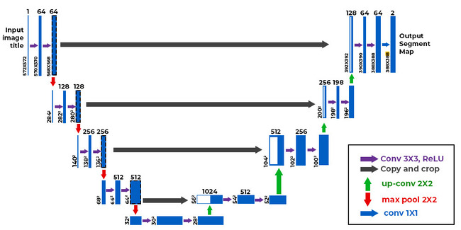

# 🛰️ Road Segmentation using U-Net (from Scratch)

This project implements a U-Net-based image segmentation model trained to extract roads from satellite images. The model is built entirely from scratch using TensorFlow and trained on the **[DeepGlobe Road Extraction Dataset](https://www.kaggle.com/datasets/balraj98/deepglobe-road-extraction-dataset)** — a real-world dataset designed for the DeepGlobe Challenge.

---

## 🧠 About U-Net

U-Net is a popular convolutional neural network architecture specifically designed for **semantic segmentation tasks**. It was originally developed for biomedical image segmentation but has been widely adopted for tasks like road extraction, building segmentation, and more.

The architecture is composed of:

- **Encoder (Contracting Path):** Downsamples the image using convolution + pooling to capture context.
- **Decoder (Expanding Path):** Upsamples the feature maps to recover spatial details and output pixel-wise predictions.
- **Skip Connections:** Features from the encoder are passed to the decoder to preserve fine-grained information, enabling precise segmentation.

---

## 🚀 Model Architecture

This implementation is a **custom, lightweight version of U-Net**, specifically designed to run on **limited hardware (CPU or single GPU laptops)**.

### 🔧 Modifications:

- **Smaller filter sizes** in the encoder-decoder blocks (starting from 32 filters instead of 64).
- Total parameters: **7.77 million**, allowing for efficient local training and inference.
- Uses `BatchNormalization` and `LeakyReLU` to improve convergence and robustness.

### Layers Overview:

- **Encoder:** 4 downsampling blocks with:
  - 2 × Conv2D + BatchNorm + Activation
  - MaxPooling2D
- **Bottleneck:** A deeper conv block for high-level feature extraction.
- **Decoder:** 4 upsampling blocks with:
  - Conv2DTranspose for upsampling
  - Skip connections from encoder
  - Followed by conv blocks
- **Final Layer:** A 1×1 convolution with sigmoid activation for binary segmentation.

---

## 📊 Loss Function

### Custom Loss Function: Binary Crossentropy + Dice Loss

To improve segmentation performance, a combination of **Binary Crossentropy** and **Dice Loss** is used. This hybrid loss balances pixel-wise accuracy with spatial overlap, addressing the class imbalance common in road extraction.

---

## 🧪 Evaluation Metric

### Custom Metric: Dice Coefficient (F1 Score for Segmentation)

The Dice Coefficient is used to evaluate how well the predicted masks overlap with the ground truth masks. It ranges from 0 (no overlap) to 1 (perfect match), making it a highly interpretable metric for binary segmentation.

---

## 🧩 Dataset

- **Name**: [DeepGlobe Road Extraction Dataset](https://www.kaggle.com/datasets/balraj98/deepglobe-road-extraction-dataset)
- **Source**: DeepGlobe 2018 Challenge
- **Description**: High-resolution satellite images with corresponding binary masks highlighting road networks.

---

## ⚙️ Training Details

- **Epochs**: 50
- **Batch Size**: 4 
- **Image Size**: 256×256  
- **Optimizer**: Adam  
- **Callbacks**: EarlyStopping + ModelCheckpoint  
- **Validation Split**: 20% of training data

---

## 📎 Note

If you have access to more powerful GPUs or cloud platforms (e.g., Google Colab, Kaggle Notebooks, or AWS), you can **easily scale up** the architecture by:
- Increasing the number of filters
- Adding dropout for regularization
- Switching to full-sized U-Net (starting filters at 64)

---

## 📜 License

This project is licensed under the MIT License.
